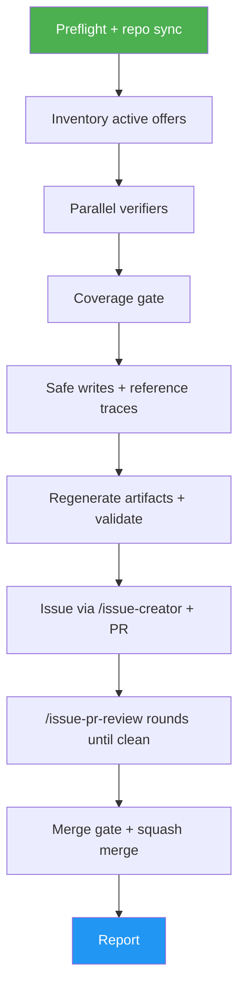

<!--
  DO NOT READ THIS FILE — This README.md is for human catalog browsing only.
  It ships inside the .skill package but is NEVER auto-loaded into agent context.
  The runtime loader only reads SKILL.md + references/ + scripts/ + agents/ when the skill triggers.
  If you're an AI agent, read the SKILL.md file instead for skill instructions.
-->

# Daily Offer Check

> Re-verify every active free-AI-credit offer against its official source, fix drifted terms, refresh the evidence trail, and ship the result from issue to merged PR, unattended.

## Highlights

- Parallel verifiers check each active offer against its official `source_url`; official information wins every conflict.
- Verifiers read pages with TinyFish and retry bot-walled or JavaScript-heavy pages in the Lightpanda headless browser.
- Safe writes only: `verified_date` bumps, expiries, and official-source rewrites of `title`, `amount`, `expiry_date`, and `signup`.
- Each verified offer's reference trace (`offers/details/<slug>.json`) gains the evidence URLs the verifier used; curated entries are never deleted.
- Files the tracking issue with `/issue-creator`, opens one PR, runs `/issue-pr-review` rounds until clean, and squash-merges behind a deterministic scope gate.

## When to Use

| Say this... | Skill will... |
| --- | --- |
| "/daily-offer-check" | Sweep, write, file the issue, open the PR, review until clean, merge |
| "run the daily offer check but don't merge" | Same, stopping with a clean PR left open |
| "daily offer check, report only" | Verify and print the evidence table; no writes, no PR |
| "re-verify these offers: a, b" | Sweep only the named slugs |

## How It Works



## Usage

```
/daily-offer-check
/daily-offer-check --no-merge
/daily-offer-check report only
```

## Resources

| Path | Description |
| --- | --- |
| `agents/verifier.md` | Read-only worker prompt and the pinned verdict schema |
| `references/trust-policy.md` | Official-source precedence, update rules, reference-trace rules |
| `references/apply-and-pr.md` | Writer output contract and issue/commit/PR publication |
| `references/review-and-merge.md` | Review rounds and the merge gate |
| `scripts/` | Inventory, coverage validation, the only writer, the scope gate, and the escaped report/PR-body renderer |

## Output

Updated offer YAMLs and reference traces, regenerated `index.json` and `llms` files, one tracking issue, one merged PR (or an open one when a gate refuses), and a per-offer evidence table with a run summary.

## Requirements

git, an authenticated `gh`, python3, node, and the `issue-creator` and `issue-pr-review` skills.

Optional:

- TinyFish (the `tinyfish` MCP server or an authenticated `tinyfish` CLI) for page reads. Without it, verifiers use the host's built-in read-only web tools.
- The `lightpanda` CLI (on `PATH` or set with `LIGHTPANDA_BIN`) as the browser. Without it, the browser retry is skipped.
