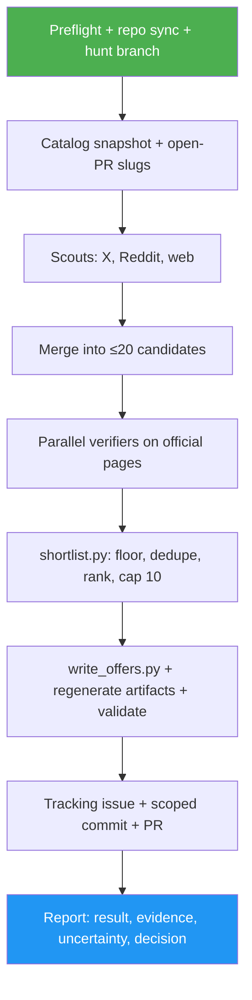

<!--
  DO NOT READ THIS FILE — This README.md is for human catalog browsing only.
  It ships inside the .skill package but is NEVER auto-loaded into agent context.
  The runtime loader only reads SKILL.md + references/ + scripts/ + agents/ when the skill triggers.
  If you're an AI agent, read the SKILL.md file instead for skill instructions.
-->

# Offer Hunter

> Scout X, Reddit, and the web for the top 10 new or improved free-AI-credit offers, confirm each on the provider's official page, and open one PR for a human to review and merge.

## Highlights

- Three parallel scouts search X (via web search plus the X oEmbed lookup), Reddit (public JSON search), and the wider web (Hacker News, search, curated lists).
- Parallel verifiers confirm every lead on the provider's own pages; official information wins every conflict, and anything unconfirmed is dropped.
- A deterministic shortlist script enforces the value floor ($5 in credit or 100,000 tokens per month-equivalent), rejects duplicates of the catalog and of open PRs, ranks, and caps at 10.
- New offers land as `verification: social_proof`, `review_status: under-review`, with a reference trace and the lead embedded as social proof.
- Uses TinyFish for search and page reads and Lightpanda for a browser retry when installed; falls back to the host's built-in web tools otherwise.
- Opens a tracking issue and one PR; it never merges. Your merge is what publishes.

## When to Use

| Say this... | Skill will... |
| --- | --- |
| "/offer-hunter" | Scout, verify, shortlist up to 10 offers, write them, open an issue and a PR |
| "/offer-hunter --max 5 coding" | Same, capped at 5 and focused on coding offers |
| "hunt for new offers, report only" | Scout, verify, and print the shortlist; no writes, no PR |

Use `/offer-updater` to add one offer you already have, and `/daily-offer-check` to re-verify the existing catalog.

## How It Works



## Usage

```
/offer-hunter
/offer-hunter --max 5 --since 14
/offer-hunter report only
```

## Resources

| Path | Description |
| --- | --- |
| `agents/scout.md` | Read-only scout prompt and the pinned lead schema |
| `agents/verifier.md` | Read-only verifier prompt and the pinned verdict schema |
| `references/sources.md` | Per-channel sources, queries, and budgets |
| `references/trust-and-value.md` | Official-source policy, verdicts, value floor, ranking |
| `references/web-tools.md` | TinyFish, Lightpanda, and oEmbed commands with fallbacks |
| `references/publish.md` | Tracking issue, scoped commit, and PR steps |
| `scripts/` | Snapshot, shortlist, writer, scope gate, and PR/issue renderer |

## Output

One open PR against `main` (body starts with `Closes #<issue>`) that adds or refreshes up to 10 offers in `offers/` and `offers/details/`, regenerates `index.json` and the llms files, and lists each offer's official quote, lead, and references, plus every candidate not included and why. Report-only runs print the same tables without writing anything.
