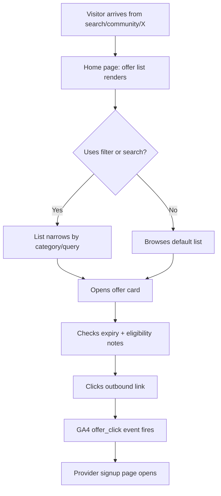
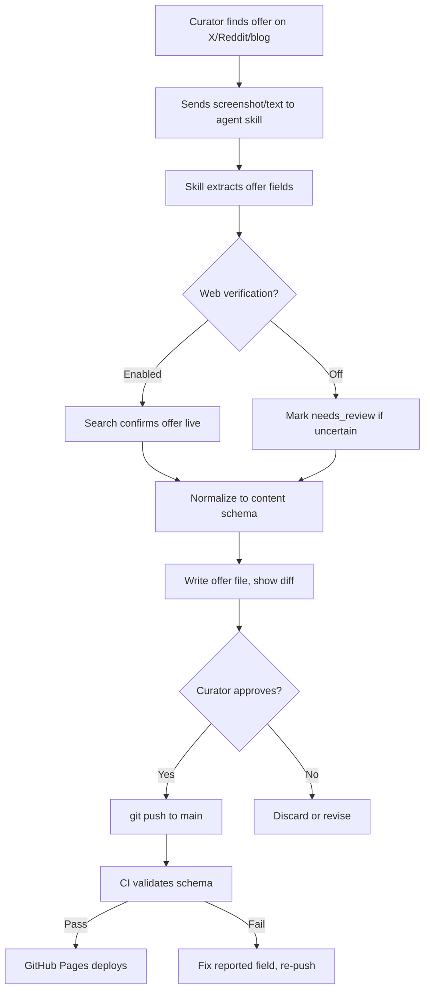
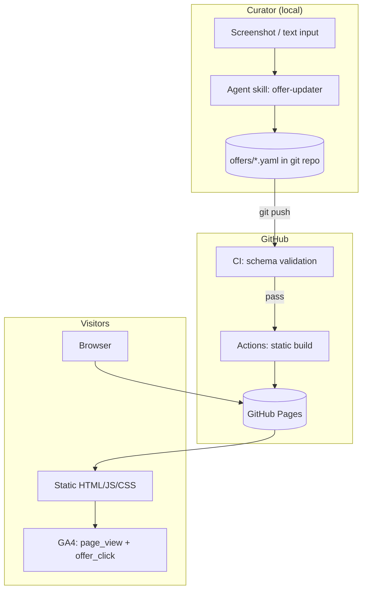

# PRD: Free AI Credits

## Document Info

| Field | Value |
|-------|-------|
| Product Name | Free AI Credits |
| Version | 1.1 |
| Last Updated | 2026-08-24 |
| Status | Draft |

Source: `idea.md`, `validate.md` (Scope Reduction v2 plan). Monetization model clarified in session: provider sponsorship only, never user payment.

---

## 1. Product Overview

### 1.1 Product Vision

A dead-simple, static website that aggregates currently-claimable free AI token/credit offers — hand-picked and self-verified by a single trusted curator. Visitors find relevant offers in seconds via filtering, search, and task categories. Content is managed entirely through git: updating the site is a commit, not an ops task.

> From idea.md: "The website content make it dead simple, just a list of offer, filtering, searching, categorizing, all statics."

### 1.2 Target Users

1. **Primary:** Indie devs / hobbyist developers building side projects on free tiers who hunt for free AI API credits weekly.
2. **Secondary:** AI content creators cycling through image/video/voice free trials.
3. **Future audience (monetization):** DevRel/growth teams at smaller AI providers who need developer acquisition channels.

### 1.3 Business Objectives

- Validate demand for a free-AI-credits destination before building any platform features (per validate.md v2 gate).
- Build an attribution-backed audience asset that providers would later pay to reach (sponsorship-only model).
- Keep operating cost at ~$0 and maintenance at minutes-per-update.

### 1.4 Success Metrics

| Metric | Target | Measurement Method |
|--------|--------|--------------------|
| Published verified offers | ≥ 20 within 2 weeks of launch | Count of offer entries in repo with verified dates |
| Monthly unique visitors | ≥ 500 by day 30 post-launch | GA4 users report |
| Offer click-through rate | ≥ 25% of visitors click ≥ 1 offer within first month | GA4 `offer_click` events / users |
| Visitor→return rate | ≥ 15% returning visitors by day 30 | GA4 new vs returning |
| Provider interest signals | ≥ 1 provider responds to attribution-backed pitch by week 6 | Outreach log (manual) |

---

## 2. User Personas

### Persona 1: Luan — Indie Dev on Free Tiers

- **Demographics**: 30s, solo developer building side projects nights & weekends, cost-sensitive, refuses to pay for APIs until forced.
- **Goals**: Ship his side project paying $0; find which providers currently give free credits for coding/API use before they expire.
- **Pain Points**: Offers are scattered across X threads, Reddit posts, and vendor blogs; limited-time promos expire before he hears about them; can't tell legit offers from spam/phishing.
- **User Journey**: Lands on the site from a community post → filters by "API provider" + "coding" category → sorts by newest → clicks out to claim 2–3 offers before they expire.
- **Quote**: "I just want one page that tells me what free credits I can still grab this week."

### Persona 2: Mira — AI Content Creator

- **Demographics**: 20s, produces images/video/voice content casually, cycles through free trials of generation tools.
- **Goals**: Keep generating content without subscriptions; find image/video/voice freebies she hasn't tried yet.
- **Pain Points**: Free-tier comparisons online are stale blog posts; trial limits and region restrictions are buried in fine print.
- **User Journey**: Searches for "free image generation credits" → lands on the site → filters category "image" → checks expiry/eligibility notes → clicks through to eligible offers only.
- **Quote**: "Half the 'free trial' lists I find died months ago."

### Persona 3: Alex — DevRel at a Small Inference Provider

- **Demographics**: Growth/DevRel role at an emerging AI inference startup needing developer signups.
- **Goals**: Get their free-credit offer in front of developers who will actually claim it and make an API call; measure campaign performance.
- **Pain Points**: Developer acquisition is expensive; generic ad traffic doesn't convert to activations; big aggregators ignore small providers.
- **User Journey**: Receives an outreach email with the site's per-offer click attribution data → agrees to a featured listing or sponsored slot.
- **Quote**: "Show me 100 clicks from real devs who claimed our credit and I'll pay for placement."

---

## 3. Feature Requirements

### 3.1 Feature Matrix

| ID | Feature | Description | Priority | Acceptance Criteria | Dependencies |
|----|---------|-------------|----------|---------------------|--------------|
| F1 | Offer list page | Single-page list of all active offers with provider, amount, expiry, category | Must | Given the site is built, When a visitor opens the home page, Then all non-expired offers render as list items with provider name, credit amount, expiry date, and category visible | F5 |
| F2 | Category filtering | Filter offers by category (API provider, coding tools, image, voice, video) | Must | Given multiple offers exist across categories, When a visitor selects a category filter, Then only matching offers remain visible without page reload | F1 |
| F3 | Text search | Client-side search over offer title/provider/description | Must | Given the full offer list is rendered, When a visitor types in the search box, Then the visible list narrows to offers matching the query within 200 ms | F1 |
| F4 | Expiry handling | Expired offers hidden from default view; expiry date shown on each card | Must | Given an offer whose expiry date has passed, When the site is rebuilt/deployed, Then the offer no longer appears in the default list but remains accessible via archive view or URL | F1, F9 |
| F5 | Git-based content model | Each offer is a structured content file (front-matter: source URL, expiry, category, amount, verified date) committed to the repo | Must | Given a new offer YAML/MD file is pushed to main, When the GitHub Pages build completes, Then the offer appears on the live site within 2 minutes | F8 |
| F6 | Per-offer click tracking | Outbound link clicks tracked per offer via GA4 event | Must | Given GA4 is configured, When a visitor clicks an outbound offer link, Then an `offer_click` event fires with offer_id, provider, and category properties | F7 |
| F7 | Site visit tracking | GA4 page-view tracking across the site | Must | Given GA4 tag is deployed, When any page loads, Then a `page_view` hits GA4 with page path | F8 |
| F8 | GitHub Pages deployment | Automated deploy workflow on push to main | Must | Given a push to main passes validation, When the Actions workflow runs, Then the built site deploys to `<user>.github.io/<repo>` successfully | F5 |
| F9 | Agent skill: offer-updater | Agent skill that takes screenshot/text input, extracts offer fields, optionally web-verifies, normalizes, writes content file, commits | Should | Given a screenshot or text of an offer, When the skill runs, Then a valid normalized offer file is produced (all required fields present, source ref included, expiry parsed) and committed after curator confirmation | F5 |
| F10 | Sort options | Sort by newest / expiring soon | Should | Given the offer list is rendered, When a visitor selects "expiring soon", Then offers reorder ascending by expiry date | F1 |
| F11 | Archive view | Browse expired offers for reference/history | Could | Given expired offers exist, When a visitor opens the archive, Then expired offers render with an "expired" badge | F4 |
| F12 | RSS feed | Feed of new offers for subscribers | Could | Given new offers are published, When a reader polls `/feed.xml`, Then new offers appear as feed items | F5 |
| F13 | Newsletter signup | Email capture for weekly digest | Could | Given a visitor wants alerts, When they submit an email, Then the address is stored and confirmed | External service |
| F14 | User accounts | Login/registration | Won't (MVP) | — | — |
| F15 | Community voting/submissions | Trust scores, user-submitted offers | Won't (MVP) | — | — |
| F16 | Dynamic backend | Server, database, runtime rendering | Won't (MVP) | — | — |

### 3.2 Feature Details

#### F1: Offer List Page

**Description**: The entire product is one fast page: every active free-AI-credit offer as a scannable card/list row.

**User Stories**:
- As an indie dev, I want to see all current free credit offers at a glance so that I can decide where to sign up in under a minute.

**Acceptance Criteria**:
- [ ] Given the site loads, When I view the home page, Then each offer shows provider, credit amount, expiry date, category badge, and outbound link
- [ ] Given an offer expires, When the next deploy happens, Then it disappears from the default list
- [ ] Given slow network, When the page loads on 3G throttling, Then content is readable within 3 seconds

**Edge Cases**:
- Zero offers pass filter/search → show friendly empty state with reset button
- Offer missing expiry → display "ongoing" instead of a date

#### F5: Git-Based Content Model

**Description**: Offers live as structured files (one per offer) with required front-matter: `title`, `provider`, `category`, `amount`, `expiry_date` (nullable), `source_url`, `verified_date`. A CI validation step rejects malformed entries.

**User Stories**:
- As the curator, I want to add an offer by committing one small file so that publishing requires no CMS or dashboard.

**Acceptance Criteria**:
- [ ] Given a well-formed offer file, When pushed to main, Then the site rebuilds and includes it
- [ ] Given a malformed offer file (missing required field), When CI validates, Then the build fails with a message naming the offending field and file

**Edge Cases**:
- Duplicate provider+title slug → validator fails with clear error
- Invalid date format → validator fails with expected format hint

#### F6: Per-Offer Click Tracking

**Description**: Every outbound offer link dispatches a GA4 `offer_click` event carrying `offer_id`, `provider`, `category`. This produces the attribution dataset later used for provider pitches.

**User Stories**:
- As the curator, I want per-offer click counts so that I can prove real developer interest when pitching providers.

**Acceptance Criteria**:
- [ ] Given a visitor clicks an offer's outbound link, When the click handler runs, Then exactly one `offer_click` event with correct parameters reaches GA4 before navigation
- [ ] Given GA4 DebugView, When I click offers in test mode, Then events appear with expected properties

#### F9: Agent Skill — Offer Updater

**Description**: A local agent skill invoked with a screenshot and/or pasted text describing an offer. Pipeline: extract fields → optional web-search verification (offer still live, terms match) → normalize into the content-file schema (source ref, expiry, category, verified date = today) → write file → present diff → commit on curator confirmation.

**User Stories**:
- As the curator, I want to send a screenshot of an X post and get a ready-to-commit offer entry so that publishing takes under two minutes.

**Acceptance Criteria**:
- [ ] Given a legible offer screenshot, When the skill runs extraction, Then all required schema fields are populated or explicitly flagged as unknown
- [ ] Given verification enabled, When web search confirms the offer is live, Then the entry gets `verified_date: <today>` and a note; if unverifiable, the skill marks it `needs_review` and does not auto-commit
- [ ] Given extraction output, When writing the file, Then it passes the same CI schema validation used for manual edits

**Edge Cases**:
- Illegible/unparseable input → skill asks a targeted clarifying question instead of guessing
- Conflicting info between screenshot and web search → surface both, require human decision

---

## 4. User Flows

### 4.1 Visitor Flow (discover → claim)

**Description**: A visitor finds, filters, and claims an offer.

**Alternative Paths**:
- If all filtered results are expired, then empty state suggests resetting filters or browsing archive.

**Error States**:
- GA4 blocked/adblocker: navigation proceeds normally; tracking loss accepted silently.

### 4.2 Curator Flow (update pipeline)

**Description**: The owner adds or refreshes an offer using the agent skill.

---

## 5. Non-Functional Requirements

### 5.1 Performance

| Requirement | Target | Notes |
|-------------|--------|-------|
| Page load (FCP) | < 1.5 s p75 mobile | Static HTML/CSS, minimal JS |
| Lighthouse performance score | ≥ 95 | Home page, mobile profile |
| Search/filter latency | < 200 ms | Client-side over ≤ 500 offers |
| Build + deploy time | < 3 min | Push-to-live cycle |
| Concurrent visitors | 10k/month | Static hosting absorbs trivially |

### 5.2 Security & Privacy

- **Authentication**: None for visitors; repo write access restricted to owner via GitHub permissions.
- **Data collection**: GA4 configured with IP anonymization; no forms, no PII storage in v1.0 (if newsletter added in v1.x, use double opt-in and a GDPR-compliant processor).
- **Supply chain**: Pinned Action versions; dependency-free or minimal-dependency build.
- **Compliance**: GA4 consent banner where required (EU visitors); privacy policy page linked in footer.

### 5.3 Compatibility

| Platform | Requirement |
|----------|-------------|
| Browsers | Chrome, Firefox, Safari, Edge (latest 2 versions) |
| Mobile | iOS Safari 14+, Android Chrome 10+ |
| Screen sizes | 320 px – 2560 px responsive |

### 5.4 Accessibility

- WCAG 2.1 AA: keyboard-navigable filters/search, semantic HTML list markup, sufficient color contrast, descriptive link text for outbound offers.

---

## 6. Technical Specifications

### 6.1 System Architecture

### 6.2 Frontend

- **Framework**: React 19 + TypeScript as the client framework and render layer (per [ADR 0002](docs/adr/0002-react-vite-migration.md), which supersedes the earlier zero-client-framework constraint). All pages are statically prerendered to plain HTML/CSS/JS served from GitHub Pages — no server, no runtime rendering.
- **State management**: URL query params for active filter/search/sort (shareable, back-button-safe).
- **Design system**: Tailwind CSS v4 with shadcn/ui components (source-copied, accessible primitives) and lucide-react icons; dark-mode-friendly.
- **Build tools**: Vite with static prerendering; offer data flows from `offers/*.yaml` into JSON/JSONL at build time. Dependencies installed via `npm ci` against a committed lockfile only.

### 6.3 Backend

- **None.** No server, no database, no runtime. All logic is build-time (schema validation, index generation) or client-side (filter/search).

### 6.4 Infrastructure

- **Hosting**: GitHub Pages (`<user>.github.io/<repo>`), custom domain deferred.
- **CI/CD**: GitHub Actions — validate → `npm ci` → Vite build (JSON/JSONL generation + prerender) → deploy to GitHub Pages on push to main. Actions pinned to full commit SHAs; installs only via the committed lockfile (see [ADR 0002](docs/adr/0002-react-vite-migration.md) for supply-chain mitigations). Target build + deploy < 3 min.
- **Monitoring**: GA4 analytics; GitHub Actions failure notifications; external uptime check optional (Could).

### 6.5 Third-Party Integrations

| Service | Purpose | Priority |
|---------|---------|----------|
| Google Analytics 4 | Visits + per-offer click attribution | Must |
| GitHub Pages + Actions | Hosting + deploy pipeline | Must |
| Web search (agent tooling) | Optional offer verification inside skill | Should |

---

## 7. Analytics & Monitoring

### 7.1 Key Metrics

| Category | Metric | Description | Target |
|----------|--------|-------------|--------|
| Engagement | Weekly visitors | Unique visitors per week | ≥ 150 by week 4 |
| Conversion | Offer CTR | offer_click events / visitors | ≥ 25% |
| Content health | Fresh-offer ratio | % of listed offers < 14 days old | ≥ 70% at any time |
| Attribution | Top-provider clicks | Clicks per provider (weekly export) | Enough volume to pitch ≥ 5 providers by week 6 |

### 7.2 Events to Track

| Event | Trigger | Properties |
|-------|---------|------------|
| `page_view` | Any page load | page_path |
| `offer_click` | Outbound offer link clicked | offer_id, provider, category |
| `filter_use` | Category filter applied | category |
| `search` | Search submitted | query_length (not raw query — privacy) |
| `sort_use` | Sort option changed | sort_option |

### 7.3 Dashboards

- **Owner (GA4):** visits, traffic sources, offer_click by provider/category, device split.
- **Content ops:** fresh vs expired counts from repo data at build time (badge on site footer).

### 7.4 Alerts

| Alert | Condition | Severity | Response |
|-------|-----------|----------|----------|
| Deploy failed | Actions workflow failure on main | High | Fix within same day; site serves last good build meanwhile |
| Stale content | No new offer commit in 7 days | Medium | Curator block-time reminder |
| Tracking outage | Zero GA4 events for 48 h while visits observed | Medium | Re-check tag deployment |

---

## 8. Release Planning

### 8.1 MVP (v1.0)

**Target Date**: 1 week from start.

**Core Features**:
- [ ] Repo scaffold with offer schema + CI validation (F5)
- [ ] Static offer list page with categories, search, expiry display (F1–F4)
- [ ] GA4 visit + offer-click tracking (F6–F7)
- [ ] GitHub Pages deploy workflow (F8)
- [ ] ≥ 10 self-verified seed offers live
- [ ] Privacy policy + footer

**Success Criteria**:
- Site live at `<user>.github.io/<repo>` with p75 FCP < 1.5 s
- First organic `offer_click` events visible in GA4 within week 1

**Launch Checklist**:
- [ ] Schema validator green on all seed offers
- [ ] GA4 DebugView confirms both event types
- [ ] Lighthouse ≥ 95 performance / ≥ 90 accessibility
- [ ] Mobile manual pass at 320 px width
- [ ] Empty state + expired-offer handling verified

### 8.2 Version 1.1 (+1–2 weeks)

**Features**:
- [ ] Agent skill `offer-updater` operational end-to-end (F9)
- [ ] Sort options incl. "expiring soon" (F10)
- [ ] Seed library grown to 20 offers; shared in 5 communities (v2 gate begins)

### 8.3 Version 2.0 (+1–2 months)

**Features**:
- [ ] Archive view (F11), RSS feed (F12)
- [ ] Newsletter digest decision point based on v1 data (F13)
- [ ] Provider outreach kit built on click-attribution data; sponsorship experiments
- [ ] Community features (voting/submissions) only if gate metrics pass — otherwise explicitly not built

---

## 9. Open Questions & Risks

### 9.1 Open Questions

| # | Question | Impact | Owner | Due |
|---|----------|--------|-------|-----|
| 1 | Exact static generator: plain build script vs Astro? | M | Curator | Before scaffold |
| 2 | Which communities/X accounts are the initial 5 distribution targets? **RESOLVED v1.1** — X, r/SideProject, Show HN, Indie Hackers, LinkedIn (see docs/outreach-log.md) | H | Curator | Week 1 |
| 3 | GA4 vs privacy-first fallback if consent friction kills EU traffic? | M | Curator | After 2 weeks of data |
| 4 | Repo public (transparency + stars signal) vs private content? | M | Curator | Before launch |

### 9.2 Assumptions

| # | Assumption | Risk if Wrong | Validation |
|---|------------|---------------|------------|
| 1 | Enough claimable offers exist weekly to sustain freshness | Site looks dead; retention collapses | Track fresh-offer ratio during weeks 1–4 |
| 2 | Solo curation at agent-assisted pace (~minutes/offer) is sustainable | Staleness treadmill returns | Time-boxed update sessions; alert at 7-day gap |
| 3 | Smaller providers will respond to attribution-backed pitches | Sponsorship thesis fails; project stays hobby | 30-provider outreach batch at week 6 |

### 9.3 Risks

| Risk | Probability | Impact | Mitigation |
|------|-------------|--------|------------|
| Content staleness (curator bandwidth drops) | High | High | Agent skill minimizes update cost; 7-day staleness alert; archive keeps pages honest |
| Low traffic despite distribution effort | Medium | High | Diversify channels (X, Reddit, HN, communities); double down where CTR is highest |
| Providers refuse sponsorship / adversarial to promo discovery | Medium | High | Pitch smaller inference platforms (acquisition-hungry), not big labs; lead with activation data |
| GA4 privacy concerns suppress adoption or trust | Low | Medium | Anonymize IP, consent banner, keep site usable without consent |
| Offer links rot or turn scammy, damaging trust | Medium | Medium | Verified-date on every card; periodic re-verification sweep; remove-on-suspicion policy |

---

## 10. Appendix

### 10.1 Competitive Analysis

| Competitor | Strengths | Weaknesses | Our Differentiation |
|------------|-----------|------------|---------------------|
| mnfst/awesome-free-llm-apis (~6k★ OSS) | Deep, precise, CC0, actively maintained | Permanent free tiers only; excludes time-limited promos; no UX | We track expiring/time-limited offers with a browsable, filterable UX |
| Perkstack ($24/mo) | Hand-verified catalog, weekly re-checks | Paid, aimed at funded startups | Free forever, aimed at broke indie devs |
| GetAIPerks ($99/mo) | Large catalog, guides | 1-star Trustpilot wall; info freely available elsewhere | Free, curated, no paywalled "guides" |
| zPlatform AI Deals | Verdicts + votes, large deal catalog | Lifetime deals focus, single curator | Focus on free credits, not paid LTDs |
| tokengratis.id | Auto-aggregated, broad | Single-language, visibly stale | English, structured expiry discipline, agent-assisted freshness |

### 10.2 Glossary

| Term | Definition |
|------|------------|
| Offer | A time-limited or ongoing free AI credit/token promotion from a provider |
| Claim deadline | The date until which an offer can be redeemed (tracked per offer) |
| Credit expiration | Account-specific expiry of already-claimed credits (out of scope v1.0) |
| Verified date | Last date the curator confirmed the offer is live |
| Attribution data | Per-offer click counts used to demonstrate developer interest to providers |
| v2 gate | Success criteria (traffic, CTR, provider response) deciding whether to continue investing |

### 10.3 Revision History

| Version | Date | Author | Changes |
|---------|------|--------|---------|
| 1.0 | 2026-08-21 | ox-alpha | Initial draft — v2 reduced-scope static site plan |
| 1.1 | 2026-08-24 | ox-alpha | §6.2/§6.4: authorize React 19 + TypeScript + Vite + Tailwind + shadcn/ui stack per ADR 0002 (supersedes zero-client-framework constraint); §6.3 backend-none unchanged |
